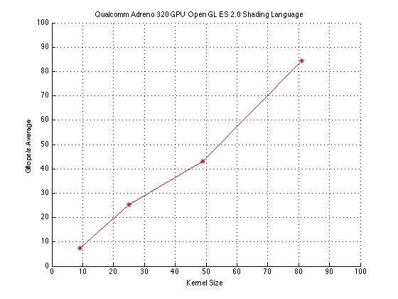

# ConvShader 2014: Convolution Network in the Mobile GPU with OpenGL ES 2.0 shading language

A first embedded implementation attempt of a Convolution Neural Network (CNN) was done in 2014 when AI wasn't so famous. 

Particularly is checked the speed in Gflops/s for a Mobile GPU Adreno 320 in the Samsung Galaxy S4 through a filter bank 3x3, 5x5, 7x7, 9x9. This has been successfully performed in Samsung GALAXY S4 with Android 4.3. 

The figure shows the complexity of the operation by the size of the filter used.

